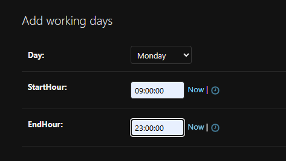
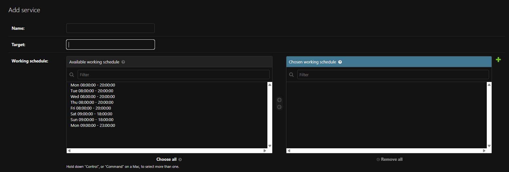
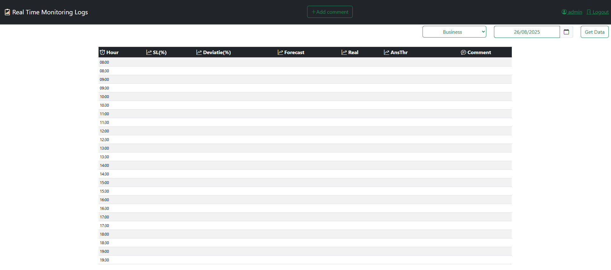

# Real Time Monitoring Logs (RTML) – Django App

## 📌 Overview

This Django application was developed to replace a manual, Excel-based workflow previously used for logging team actions during the monitoring of call center services. At my former workplace, workforce analysts were required to:

- Log monitoring actions into daily Excel files.
- Add new Excel files daily for the monitored services.
- Manage folders for each month's files.
- Archive older files and folders.

This process was inefficient and time-consuming.

The RTML app automates this workflow by:

- Utilizing a Django database to store monitoring comments.
- Connecting to an external database to fetch and display key performance indicators (KPIs).
- Eliminating the need to manage multiple Excel files and folders.

---

## 🚀 Features

- **Structured Data Storage**: Monitoring logs are stored in a structured Django database.
- **Centralized Dashboard**: View and analyze team input in one centralized dashboard.
- **External Database Integration**: Connect to external databases to automatically fetch KPIs (e.g., service levels, call volumes, forecasts).
- **Historical Data Management**: Archive and retrieve historical data without handling files manually.
- **Role-Based Access**:
  - Users in the **WFM group** see an **“Add comment”** button in the navigation bar, allowing them to submit new monitoring entries through an offcanvas form.
  - Users not in the **WFM group** have **read-only access**, meaning they can view the monitoring table but cannot add new comments.

---

## ⚙️ Tech Stack

- **Backend**: Django (Python)
- **Database**: MySQL (with `django-environ` for environment variables)
- **Frontend**: Django templates + Bootstrap 4
- **External DB Connection**: Multiple databases (`default` and `kpi`)

---

## ⚡ Getting Started

### 1. Clone the Repository

```bash
git clone https://github.com/dcneacsu5/RTML.git
cd RTML
```

2. Create and activate a virtual environment
```bash
python -m venv venv
source venv/bin/activate  # On Linux/Mac
venv\Scripts\activate     # On Windows
```

4. Install dependencies
`pip install -r requirements.txt`

6. Configure environment variables

This project uses django-environ to manage secrets and database credentials.
Create a .env file in the project root with the following variables:
```
# Django secret
DJANGO_SECRET_KEY=your_secret_key

# Default Database (App storage)
DEFAULT_DB_NAME=your_db_name
DEFAULT_DB_USER=your_db_user
DEFAULT_DB_PASSWORD=your_db_password
DEFAULT_DB_HOST=localhost
DEFAULT_DB_PORT=3306

# KPI Database (External source)
KPI_DB_NAME=your_kpi_db_name
KPI_DB_USER=your_kpi_db_user
KPI_DB_PASSWORD=your_kpi_db_password
KPI_DB_HOST=external_host
KPI_DB_PORT=3306
```

⚠️ Make sure MySQL is running and both databases are accessible.

5. Run migrations
`python manage.py migrate`

6. Create a superuser
`python manage.py createsuperuser`

7. Collect static files (for production)
`python manage.py collectstatic`

8. Start the development server
`python manage.py runserver`


Visit the app at: http://127.0.0.1:8000/

---

## 📊 Use Cases

- Real-time monitoring of call center KPIs.
- Logging workforce management actions and decisions.
- Replacing messy Excel file management with a centralized, searchable system.

---
## ⚙️ Configuration in Django Admin

Before using the app, you need to define **Working Days** and **Services** in the Django Admin interface.

### 1. Working Days
1. Log in to the Django Admin panel at: `/admin/`
2. Go to the **Working Days** model.
3. Create a new working day entry for each day of the week:
   - Example:
     - **Monday** → 07:00 - 20:00
     - **Tuesday** → 07:00 - 20:00
     - …and so on for all weekdays.
4. Save each working day entry.



### 2. Services
1. Go to the **Services** model in Django Admin.
2. Create a new service by specifying:
   - **Service Name**
   - **Select the working days** that apply to this service (checkboxes or multiselect depending on your model setup).
3. Save the service.



> ⚠️ Ensure that each service is assigned the appropriate working days, as the accuracy of the monitoring table relies on this configuration.

If configured correctly, your Django page should look similar to the screenshots below:



---

